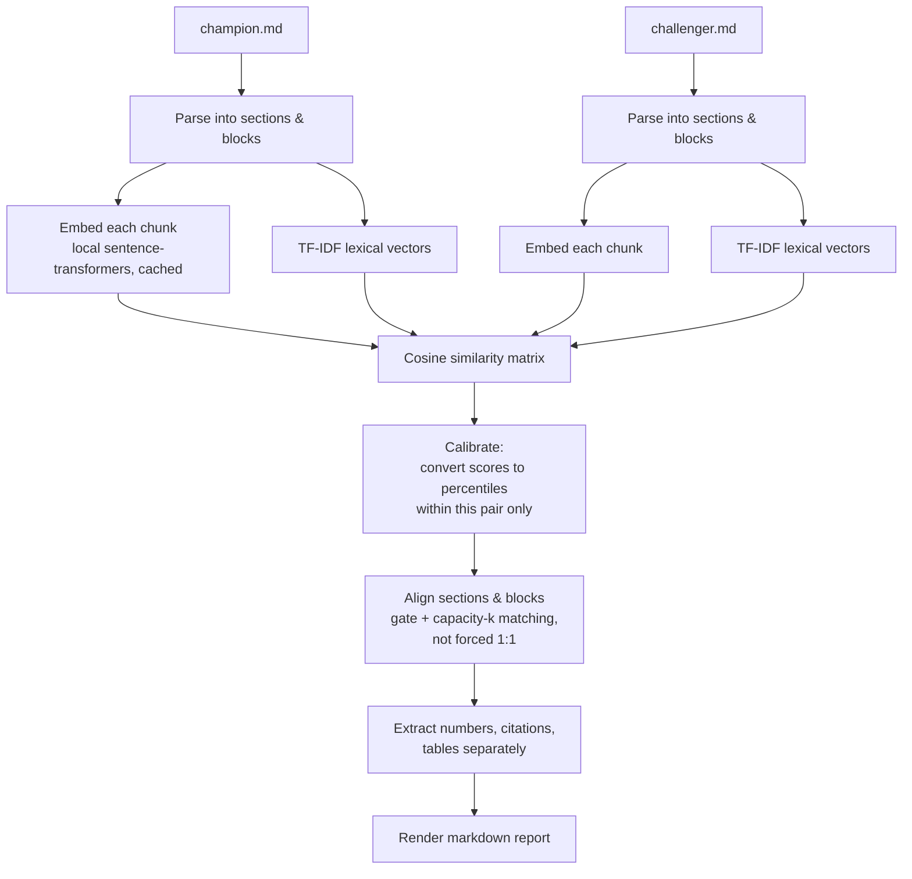
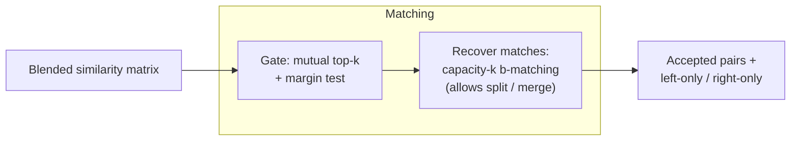

# Academic Literature Compare — the short version

Compares two papers (a "champion" and a "challenger") and produces a
side-by-side report: what matches, what's only on one side, and where
matched passages disagree on numbers or claims.

The hard part: two papers on the same topic almost never share the same
outline. So this tool never compares "section 3 to section 3" — it figures
out what corresponds by *meaning*, not by position.

## Pipeline

## Why not just "most similar section wins"?

Two problems with a naive best-match approach, found by testing on the
included fixture papers:

1. **Forcing every section to pair with something is wrong.** Real papers
   have sections with no true counterpart (e.g. "Governance" only exists on
   one side). A forced 1:1 assignment pairs them off anyway, and one bad
   "confident" pair can bump a correct pair out of place.
2. **A raw similarity score means nothing on its own.** What counts as
   "clearly a match" varies by embedding model and by how similar the two
   documents are overall. So every score is converted to a **percentile
   within that comparison's own similarity matrix** before any decision is
   made — no hard-coded cutoff.

## Two independent signals, blended

* **Embeddings** — catch matches that are worded differently but mean the
  same thing (e.g. "Probability of default" ↔ "Default hazard").
* **Lexical (TF-IDF)** — catch matches embeddings miss: shared exact
  numbers, citations, or repeated named terms.

These are blended *after* calibration, not before, so neither channel's
raw scale dominates.

## Handled outside the similarity matrix entirely

* **Bibliographies** — matched by normalized `(surname, year)` keys, since
  citation-dense text has a "similar register" that fools embeddings into
  matching reference lists that don't actually share citations.
* **Numbers** — extracted and cross-indexed directly (e.g. does each paper
  report the same LGD/Gini/AUC?), because this is a deterministic lookup,
  not a similarity question.
* **Tables** — treated as first-class content, not stripped out, since
  numeric payloads often carry the real signal.

## Output

One markdown report per pair: an alignment map, side-by-side excerpts with
scores, "only in champion" / "only in challenger" lists, and a numeral/
citation/terminology cross-index. See `README.md` for full usage and CLI
flags.
